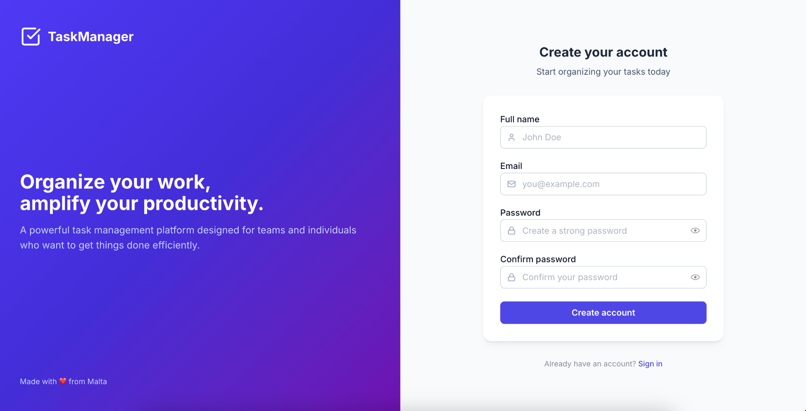
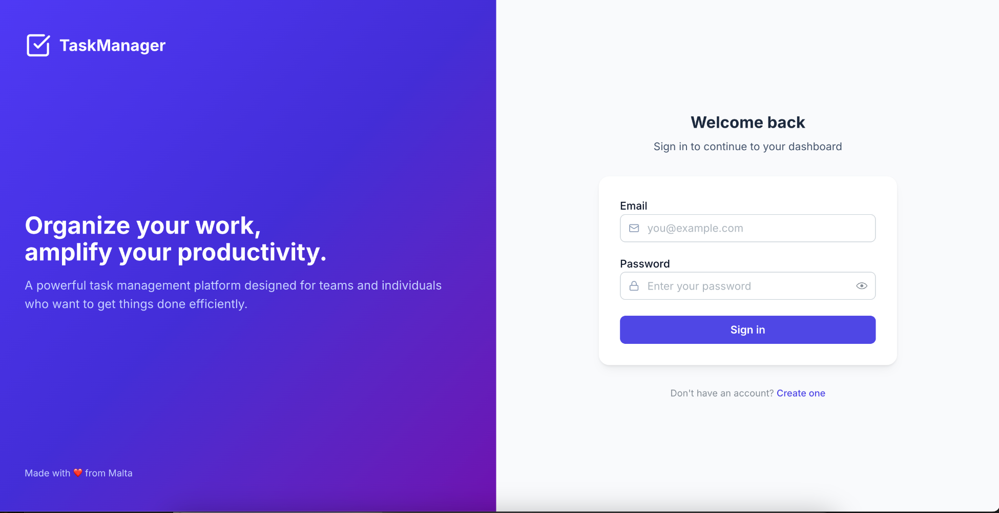
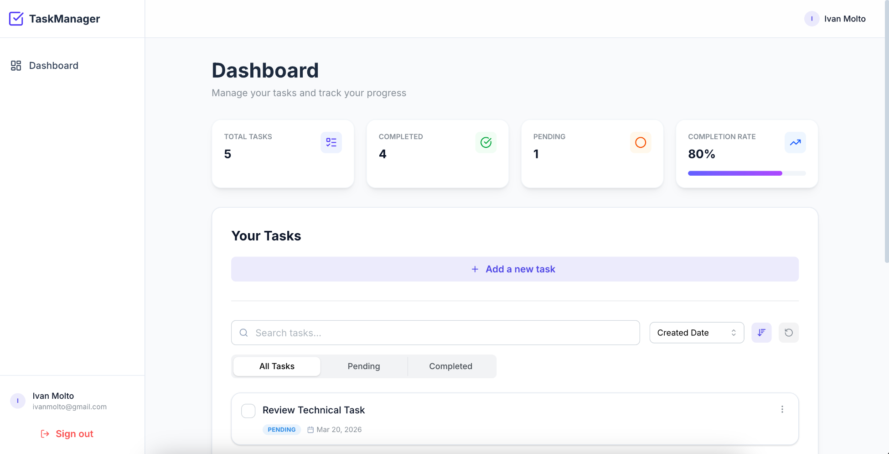
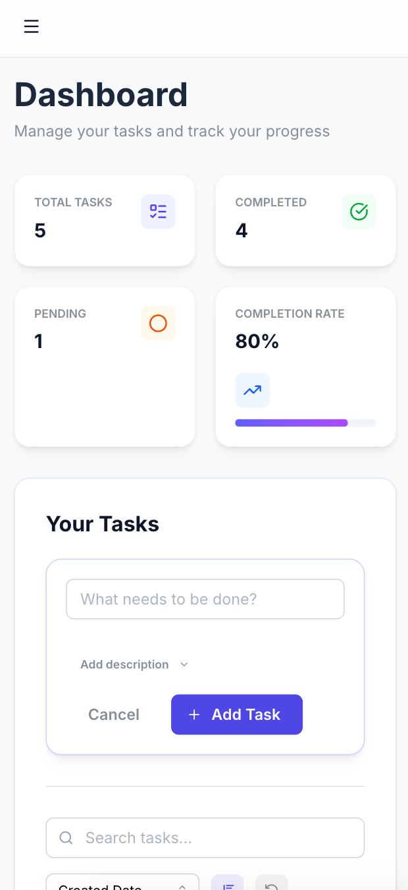

# SaaS Task Manager

A production-grade, microservices-based task management application built to demonstrate clean architecture, modular domain modeling, and scalable code organization.

## 🏗️ Architecture Overview

```
┌─────────────────────────────────────────────────────────────────┐
│                         Frontend (Next.js)                      │
│                    http://localhost:3000                        │
└─────────────────────────────────────────────────────────────────┘
                                │
                                ▼
┌─────────────────────────────────────────────────────────────────┐
│                    API Gateway (NestJS)                         │
│                    http://localhost:4000                        │
│  • Request validation & logging                                 │
│  • JWT authentication guards                                    │
│  • Rate limiting & caching                                      │
│  • Global exception handling                                    │
└─────────────────────────────────────────────────────────────────┘
                                 │
                        ┌───────-┴────────┐
                        ▼                 ▼
              ┌─────────────────-┐  ┌──────────────────┐
              │   Auth Service   │  │   Task Service   │
              │   (TCP: 4001)    │  │   (TCP: 4002)    │
              │                  │  │                  │
              │  • User CRUD     │  │  • Task CRUD     │
              │  • JWT tokens    │  │  • Pagination    │
              │  • Token refresh │  │  • Filtering     │
              │  • Password hash │  │  • Sorting       │
              └───────┬─────────-┘  └────────┬─────────┘
                      │                      │
                      └──────────┬──────────-┘
                                 ▼
                        ┌──────────────────┐
                        │   PostgreSQL     │
                        │   (Port: 5432)   │
                        └──────────────────┘
```

## 🛠️ Tech Stack

### Frontend

- **Framework**: Next.js 16 (App Router), React 19, TypeScript
- **Styling & UI**: Tailwind CSS 4, Mantine UI
- **State Managementy**: TanStack Query (Server State), Zustand (Client State)
- **Form Handling**: React Hook Form + Zod (Strict type inference)
- **Testing**: Unit tests, Playwright (End-to-End Testing)

### Backend

- **Framework**: NestJS (Microservices Architecture)
- **Database**: PostgreSQL with Prisma ORM
- **Transport**: TCP for inter-service communication
- **Validation**: Class Validator + DTOs
- **Security**: JWT (Access/Refresh rotation), bcrypt

### Infrastructure

- **Containerization**: Docker + Docker Compose (Multi-stage optimized builds)
- **Caching/Rate Limiting**: Redis

## 📸 Application Previews

|                              Desktop Signup                              |                             Desktop Login                              |
| :----------------------------------------------------------------------: | :--------------------------------------------------------------------: |
|  |  |

|                             Desktop Dashboard                             |                            Mobile Dashboard                             |
| :-----------------------------------------------------------------------: | :---------------------------------------------------------------------: |
|  |  |

## 🚀 Getting Started

### Prerequisites

- Docker Desktop 4.x+ installed and running
- Node.js 20+ (for local development)
- pnpm 8+ (recommended) or npm
- Git

### Environment Variables

See `.env.example` files in each service for required configuration.

### Quick Start (Docker)

```bash
# Clone the repository
git clone <repository-url>
cd task-manager

# Start all services
docker compose up -d

# View logs
docker compose logs -f
```

The application will be available at:

- **Frontend**: http://localhost:3000
- **API Gateway**: http://localhost:4000
- **API Documentation**: http://localhost:4000/api/docs

### Local Development

```bash
# Install dependencies for all services
pnpm install

# Start database
docker compose up -d postgres redis

# Run migrations
cd services/auth-service && pnpm prisma migrate dev
cd ../task-service && pnpm prisma migrate dev

# Generate Prisma clients
cd services/auth-service && pnpm prisma generate
cd ../task-service && pnpm prisma generate

# Start services (in separate terminals)
cd services/auth-service && pnpm start:dev
cd services/task-service && pnpm start:dev
cd services/api-gateway && pnpm start:dev
cd frontend && pnpm dev
```

## 📁 Project Structure

```
task-manager/
├── frontend/                    # Next.js frontend application
│   ├── src/
│   │   ├── app/                # App router pages
│   │   ├── components/         # Reusable UI components
│   │   ├── hooks/              # Custom React hooks
│   │   ├── services/           # API service layer
│   │   ├── stores/             # Zustand state stores
│   │   ├── tests/              # Playwright tests
│   │   └── types/              # TypeScript definitions
│   └── ...
├── services/
│   ├── api-gateway/            # Central entry point
│   │   ├── src/
│   │   │   ├── auth/           # Auth module (proxy)
│   │   │   ├── tasks/          # Tasks module (proxy)
│   │   │   ├── common/         # Shared utilities
│   │   │   │   ├── filters/    # Exception filters
│   │   │   │   ├── interceptors/
│   │   │   │   └── decorators/
│   │   │   └── ...
│   │   └── ...
│   ├── auth-service/           # Authentication microservice
│   │   ├── src/
│   │   │   ├── auth/           # Auth domain
│   │   │   │   ├── dto/        # Data transfer objects
│   │   │   │   └── ...
│   │   │   ├── users/          # User domain
│   │   │   └── prisma/         # Database schema
│   │   └── ...
│   └── task-service/           # Task management microservice
│       ├── src/
│       │   ├── tasks/          # Task domain
│       │   │   ├── dto/
│       │   │   └── ...
│       │   └── prisma/
│       └── ...
├── docker-compose.yml
└── README.md
```

## 🧠 Key Design Decisions & Trade-offs

### 1. Microservices via TCP Transport

Chose **TCP transport** over standard HTTP for inter-service communication.

- **Decision**: The API Gateway communicates with the Auth and Task services via TCP.
- **Benefit**: Lower network overhead, faster synchronous execution, and built-in NestJS message patterns.
- **Trade-off**: Harder to debug manually via Postman compared to HTTP, mitigated by centralizing API documentation and testing at the Gateway level.

### 2. JWT with Refresh Token Rotation

Implemented a highly secure authentication flow to protect user sessions.

- **Decision**: Access tokens are short-lived (15m). Refresh tokens are long-lived (7d) and stored securely in the database.
- **Benefit**: Upon requesting a new access token, the old refresh token is invalidated and a new one is rotated in. If a refresh token is stolen and reused, the system detects the anomaly and revokes all access for that user family.

### 3. Frontend State Separation (TanStack + Zustand)

- **Decision**: Abstracted API interactions using custom hooks. Used TanStack Query for server-state (caching, deduplication, background updates) and Zustand for localized UI/Client state.
- **Benefit**: Dramatically reduces unnecessary re-renders. Forms utilize `react-hook-form` and `zod` for strictly-typed validation that mirrors the backend DTOs.

### 4. Optimized Docker Multi-Stage Builds

- **Decision**: The Next.js frontend uses a multi-stage Dockerfile leveraging Next's `standalone` output mode.
- **Benefit**: Reduces the final production image size from >1GB (standard `node_modules`) to ~150MB by automatically tracing and copying only the required production files. Symlink issues commonly found in monorepo/pnpm Docker builds are resolved via strict `.dockerignore` configurations.

### 5. API Gateway Pattern

- **Decision**: A central gateway handles all cross-cutting concerns (Global Exception Filters, JWT Guards, Rate Limiting).
- **Benefit**: Microservices remain purely focused on domain logic and are completely isolated from the outside internet.

## 🔒 Security Features

- **Password Hashing**: bcrypt with salt rounds
- **JWT Validation**: RS256 algorithm option available
- **Rate Limiting**: Configurable per endpoint
- **Input Validation**: Class-validator on all DTOs
- **CORS**: Configured for allowed origins
- **Helmet**: Security headers enabled

## 📊 API Endpoints

### Authentication

| Method | Endpoint            | Description                       |
| ------ | ------------------- | --------------------------------- |
| POST   | `/api/auth/signup`  | Register new user                 |
| POST   | `/api/auth/login`   | Login user                        |
| POST   | `/api/auth/refresh` | Refresh access token              |
| POST   | `/api/auth/logout`  | Logout (invalidate refresh token) |
| GET    | `/api/auth/me`      | Get current user                  |

### Tasks

| Method | Endpoint                  | Description            |
| ------ | ------------------------- | ---------------------- |
| GET    | `/api/tasks`              | List tasks (paginated) |
| POST   | `/api/tasks`              | Create task            |
| GET    | `/api/tasks/:id`          | Get task by ID         |
| PATCH  | `/api/tasks/:id`          | Update task            |
| DELETE | `/api/tasks/:id`          | Delete task            |
| PATCH  | `/api/tasks/:id/complete` | Toggle completion      |

## 🧪 Testing Strategy

The application employs a testing strategy including unit tests and End-to-End (E2E) testing to ensure the entire microservice architecture functions cohesively from the user's perspective.

```bash
# Run unit tests
pnpm test

```

### Playwright E2E Tests

To run the automated browser tests locally:

```bash
# Ensure containers are running first
pnpm exec playwright test --ui
```

_The UI mode allows you to visually step through the authentication flow, routing, and task management interactions._

## ⚠️ Known Limitations & Potential Future Improvements

Current Limitations

1. **Shared Database Instance**: While logically separated by schemas/models, the microservices share a single PostgreSQL container. In a true enterprise environment, each service should own an entirely separate database instance.
2. **Synchronous Communication**: The system currently relies on synchronous TCP calls. If the Task Service is down, the Gateway cannot process task requests.
3. **Limited Observability**: Basic logging only; add OpenTelemetry for production.

Future Improvements

1. **Event-Driven Architecture (Message Queue)**: Introduce RabbitMQ or Kafka to handle asynchronous events (e.g., emitting a `UserCreated` event that the Task service listens to for setting up default onboarding tasks).
2. **RxJS Retry Logic**: Implement advanced RxJS operators in the API Gateway to handle transient network failures between microservices (e.g., automatic retries with exponential backoff).
3. **CI/CD Pipeline**: Implement GitHub Actions to automatically run Prisma migrations, execute Playwright E2E tests, and build Docker images on pull requests.
4. **Global Test Teardown**: Enhance the Playwright setup with global fixtures to automatically seed and clear the database before and after test runs.

## 📜 License

MIT License - see LICENSE file for details.
